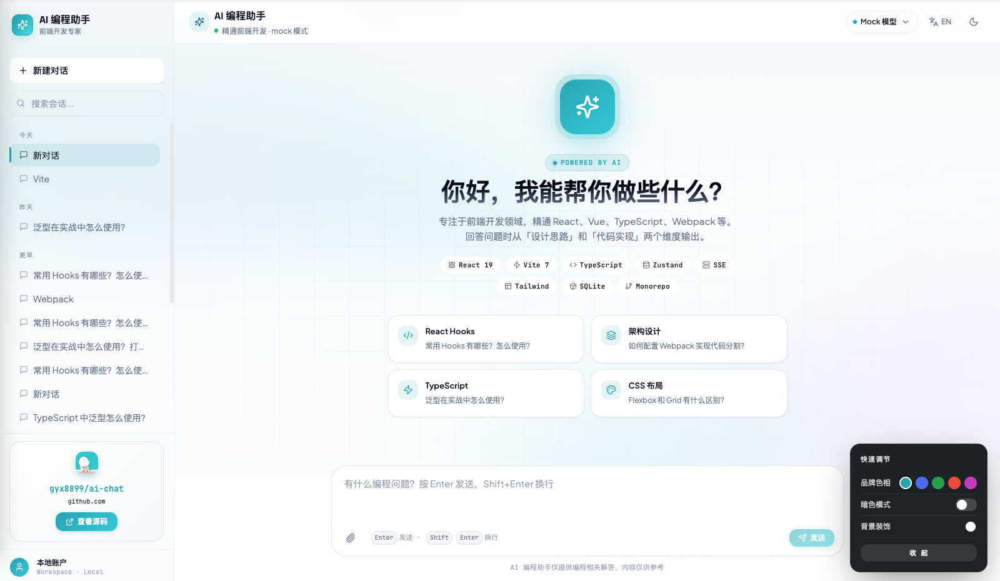
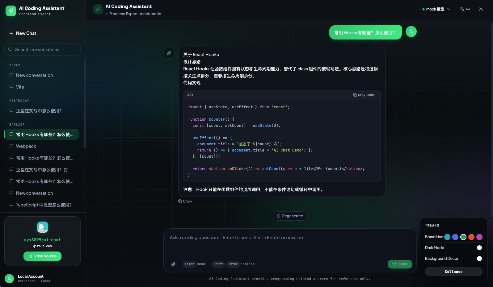
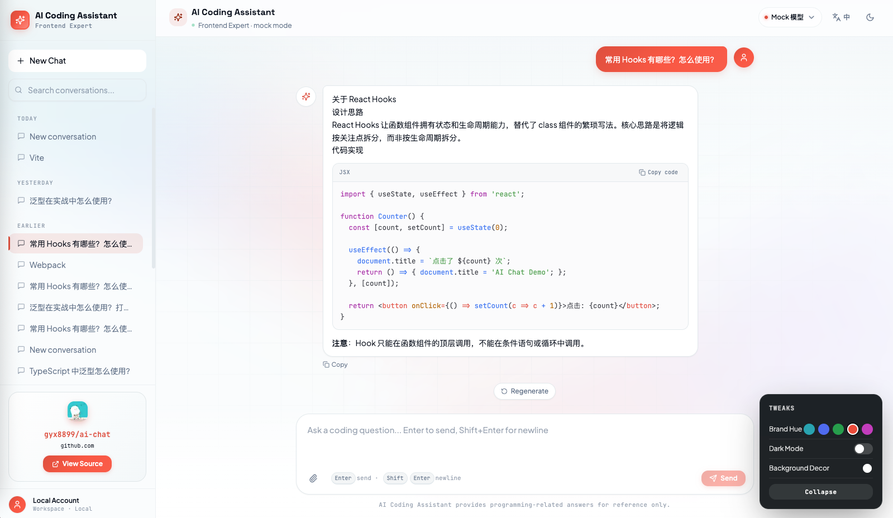
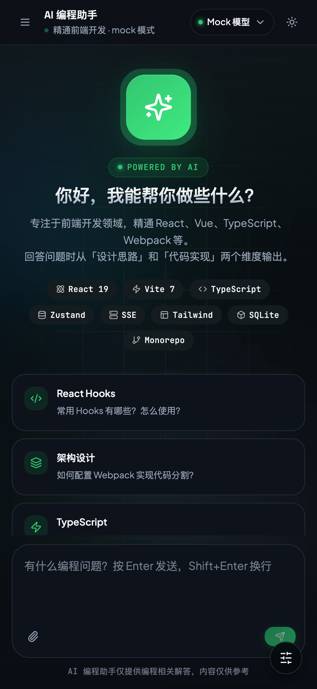
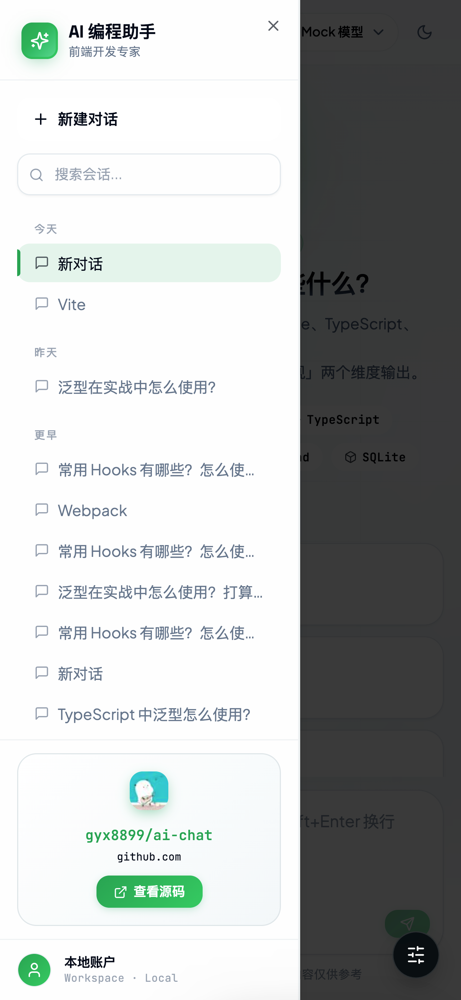

# AI Chat Demo

🌐 **在线体验**: [https://gyx8899.github.io/ai-chat/](https://gyx8899.github.io/ai-chat/)

AI 对话应用 Demo，演示 SSE 流式输出、模拟 RAG 检索、多会话管理、历史记忆等核心架构与技术方案。

## 界面预览

| 蓝色主题（中文） | 绿色暗色主题（中文） | 浅色主题（英文） |
|----------------|---------------------|----------------|
|  |  |  |

| 移动端主界面 | 移动端侧边栏 |
|--------------|--------------|
|  |  |

## 功能特性

- **SSE 流式输出** - 打字机效果，实时显示 AI 回复
- **模拟 RAG 检索** - 预设前端知识库，关键词匹配后注入提示词
- **历史对话记忆** - SQLite 持久化存储，按会话隔离历史
- **多会话管理** - 新建、重命名、删除会话，刷新不丢失
- **停止生成** - 随时中断 SSE 请求，保留已生成内容
- **重新生成** - 一键重新获取上一个问题的回复
- **空状态引导** - 推荐示例问题，点击自动填充
- **代码高亮** - Markdown 代码块语法高亮 + 一键复制
- **暗色模式** - Tailwind `dark:` 类，系统偏好自动跟随
- **移动端适配** - < 768px 抽屉式侧边栏

## 技术栈

| 层级 | 技术 |
|------|------|
| 前端框架 | React 19 + Vite 7 + TypeScript 5.9 |
| 状态管理 | Zustand 5 |
| UI 组件 | shadcn/ui + Tailwind CSS 3.4 |
| 图标 | lucide-react |
| Toast | sonner |
| Markdown | react-markdown + remark-gfm + react-syntax-highlighter |
| 后端框架 | Node.js 20+ + Express 4（CommonJS） |
| 通信协议 | SSE（Server-Sent Events） |
| 数据存储 | SQLite（better-sqlite3） |
| 共享包 | @ai-chat/shared（tsup 构建为 ESM） |
| 工具链 | ESLint 9 + Prettier 3 + Husky + lint-staged |

## 快速启动

### 环境要求

- Node.js >= 20

```bash
# 使用 nvm 切换到指定版本（项目根目录已有 .nvmrc）
nvm use
```

### 安装依赖

```bash
# 一键安装 root / shared / server / client 依赖
npm run install:all
```

### 启动开发服务

```bash
# 同时启动前端（5173）和后端（3001）
npm run dev
```

访问 http://localhost:5173 开始使用。

### 单独启动

```bash
# 仅启动后端
npm run dev:server

# 仅启动前端
npm run dev:client
```

## 项目结构

```
ai/
├── client/                 # React 前端（Vite + TS，type: module）
│   └── src/
│       ├── components/
│       │   ├── ui/         # shadcn/ui 原子组件（Button / Input / Dialog 等）
│       │   ├── Sidebar/    # 会话列表（含抽屉式移动端适配）
│       │   ├── ChatArea/   # 对话区（含 ChatHeader / ModelSelector）
│       │   ├── MessageList/# 消息列表（Markdown 渲染 + 代码高亮）
│       │   ├── InputArea/  # 输入框（含附件上传、长度校验）
│       │   └── EmptyState/ # 空状态引导（示例问题）
│       ├── hooks/
│       │   └── useChat.ts  # 流式请求逻辑（SSE 封装）
│       ├── store/
│       │   ├── chatStore.ts    # 当前消息流
│       │   ├── sessionStore.ts # 会话 CRUD 与持久化
│       │   ├── modelStore.ts   # 模型选择
│       │   └── uiStore.ts      # 主题 / Toast / 抽屉
│       ├── lib/
│       │   ├── sseClient.ts    # SSE 统一封装（streamSSE）
│       │   ├── detectOffline.ts# 离线探测（3s 超时）
│       │   └── localMode.ts    # 本地模式降级配置
│       ├── types/index.ts      # TypeScript 类型定义
│       └── locales/            # i18n 词条（zh / en）
├── server/                 # Node.js 后端（CommonJS）
│   ├── index.js            # Express 入口（端口 3001）
│   ├── routes/
│   │   ├── chat.js         # POST /api/chat（SSE 流式接口）
│   │   ├── sessions.js     # 会话 CRUD 接口
│   │   └── config.js       # 模型配置与切换
│   ├── services/
│   │   ├── llmService.js   # LLM 抽象层（mock / openai / ollama）
│   │   ├── memoryService.js# SQLite 会话与消息管理
│   │   └── ragService.js   # 知识库关键词检索
│   ├── data/
│   │   ├── models.js       # 可用模型列表（mock + 真实模型）
│   │   └── knowledge.js    # 预设前端知识库
│   └── .env.example        # 配置项说明
└── shared/                 # 共享包 @ai-chat/shared（ESM）
    └── src/
        ├── components/     # 无样式通用组件（ErrorBoundary / LoggerProvider 等）
        ├── hooks/          # 通用 Hook（useAutoScroll / useClickCallback 等）
        └── utils/          # 工具函数（cn / logger 等）
```

## 接入真实 LLM

复制并修改 `.env` 文件：

```bash
cp server/.env.example server/.env
```

编辑 `server/.env`：

```env
# 切换为真实模式（openai / ollama，ollama 需本地部署）
LLM_PROVIDER=openai
LLM_API_KEY=your-api-key
LLM_MODEL=gpt-4o
LLM_BASE_URL=https://api.openai.com/v1
```

支持的模型（在 `server/data/models.js` 中配置）：

| 模型 ID | 提供商 | 说明 |
|---------|--------|------|
| `mock` | mock | 本地预设规则，无需 API Key，适合开发调试 |
| `gpt-4o` | openai | OpenAI 旗舰多模态模型 |
| `gpt-4o-mini` | openai | GPT-4o 轻量版，速度快、成本低 |
| `deepseek-v3` | openai | DeepSeek V3，代码能力突出（OpenAI 兼容接口） |
| `qwen-max` | openai | 阿里通义千问旗舰版（OpenAI 兼容接口） |
| `llama3:8b` | ollama | 本地 Ollama 部署，数据不出本机 |

> 任意 OpenAI 兼容接口的模型均可通过配置 `LLM_BASE_URL` 与 `LLM_MODEL` 接入。

## 常用命令

```bash
# 开发
npm run dev              # 同时启动前后端
npm run dev:server       # 仅启动后端
npm run dev:client       # 仅启动前端

# 代码质量
npm run lint             # ESLint 检查（shared → client → server）
npm run lint:fix         # 自动修复
npm run format           # Prettier 格式化
npm run format:check     # Prettier 校验
npm run type-check       # TypeScript 类型检查

# 测试
npm run test:all         # 运行全部测试套件

# 构建
npm run build:shared     # 构建共享包
npm run build:frontend   # 构建前端（含 shared）
npm run build:static     # 静态构建（gh-pages 部署）
npm run deploy:frontend  # 构建并部署到 gh-pages
```

## 架构规范

- **前端 SSE**：统一通过 `client/src/lib/sseClient.ts` 的 `streamSSE` 封装，禁止在业务层直接操作 `ReadableStream.getReader()`
- **后端分层**：`routes/` 只做请求解析与 SSE 响应头设置，`services/` 承载业务逻辑与副作用（数据库 / LLM 调用）
- **状态管理**：四个 Zustand Store 各司其职（sessionStore / chatStore / modelStore / uiStore）
- **本地模式**：3s 超时探测后端可用性，失败则自动降级为 `localMode`

## 许可证

MIT
